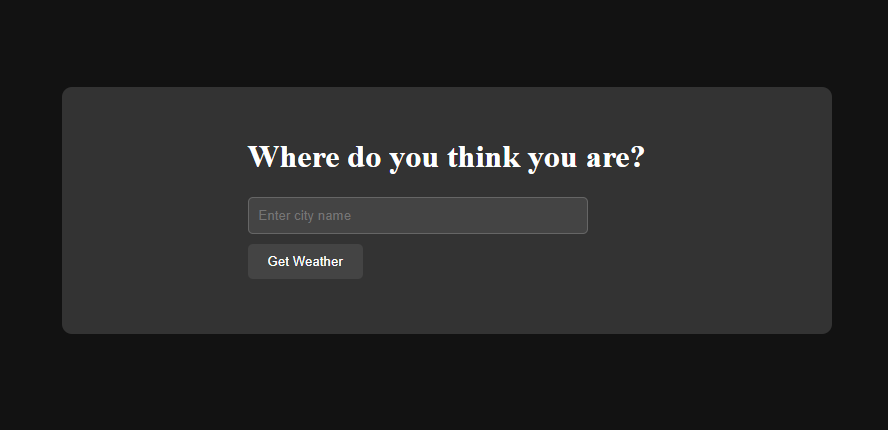
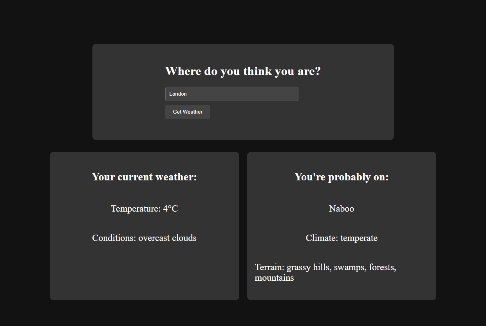

# Where Am I?

## Description
A small web app that consumes the OpenWeather and StarWars APIs to display the weather and a random StarWars planet 
based on the weather.

Made to experiment with Go

Extension:
* Use HTTP mocks in testing

